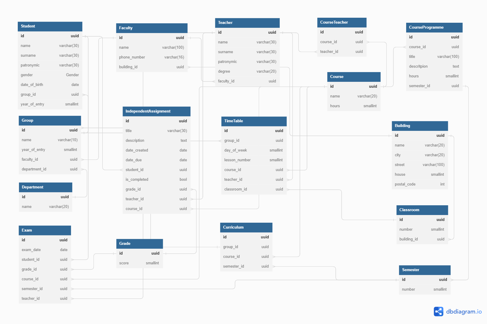

<div id="top" align="center">
  <h1>Тестовое задание "Полимедика"</h1>
</div>

<details>
    <summary>Оглавление</summary>
    <ul>
      <li>
        <a href="#часть-1">Часть 1: База данных</a>
        <ol>
          <li><a href="#er-диаграмма">ER-диаграмма</a></li>
          <li><a href="#sql-скрипт">SQL-скрипт</a></li>
          <li><a href="#описание-сущностей">Описание сущностей и их свойств</a></li>
        </ol>
      </li>
      <li>
        <a href="#часть-2">Часть 2: SQL-запросы</a>
        <ol>
          <li><a href="#запрос-1">Выбрать всех студентов, обучающихся на курсе "Математика"</a></li>
          <li><a href="#запрос-2">Обновить оценку студента по курсу.</a></li>
          <li><a href="#запрос-3">Выбрать всех преподавателей, которые преподают в здании №3.</a></li>
          <li><a href="#запрос-4">Удалить задание для самостоятельной работы, которое было создано более года назад</a></li>
          <li><a href="#запрос-5">Добавить новый семестр в учебный год</a></li>
        </ol>
      </li>
      <li>
        <a href="#часть-3">Часть 3: FastAPI</a>
        <ol>
          <li><a href="#fastapi-описание">Краткое описание приложения</a></li>
          <li><a href="#fastapi-эндпойнты">Реализованные эндпойнты</a></li>
        </ol>
      </li>
      <li>
        <a href="#часть-4">Часть 4: Публикация и документация</a>
        <ol>
          <li><a href="#описание-проекта">Описание проекта</a></li>
          <li><a href="#инструкции-по-установке">Инструкции по установке и запуску</a></li>
          <li><a href="#инструкии-по-использованию-api">Инструкции по использованию API</a></li>
        </ol>
      </li>
      <li>
        <a href="#автор">Автор</a>
      </li>
    </ul>
</details>

<div id="часть-1"></div>

## Часть 1: База данных

<div id="er-диаграмма"></div>

### 1. ER-диаграмма
На рисунке приведена ER-диаграмма, которая описывает все сущности БД и связи между ними.
  > **Note**:
  > Диаграмму базы данных в интерактивном режиме можно посмотреть по ссылке: https://dbdiagram.io/d/647dec5b722eb774946b536a



<p align="right">(<a href="#top">наверх</a>)</p>


<div id="sql-скрипт"></div>

### 2. SQL-скрипт
SQL скрипт, который создаёт все таблицы с полями, их типами данных, ключами и связями
<details>
<summary>Открыть спойлер</summary>

```SQL
CREATE TYPE gender AS ENUM ('MALE', 'FEMALE');

CREATE TABLE IF NOT EXISTS department (
  id uuid PRIMARY KEY DEFAULT gen_random_uuid() NOT NULL,
  name varchar(20) NOT NULL
);

CREATE TABLE IF NOT EXISTS building (
  id uuid PRIMARY KEY DEFAULT gen_random_uuid() NOT NULL,
  name varchar(20) NOT NULL,
  city varchar(20) NOT NULL,
  street varchar(100) NOT NULL,
  house smallint NOT NULL,
  postal_code int NOT NULL,
  UNIQUE (name)
);

CREATE TABLE IF NOT EXISTS faculty (
  id uuid PRIMARY KEY DEFAULT gen_random_uuid() NOT NULL,
  name varchar(100) NOT NULL,
  phone_number varchar(16) NOT NULL,
  building_id uuid REFERENCES building(id)
);

CREATE TABLE IF NOT EXISTS "group" (
  id uuid PRIMARY KEY DEFAULT gen_random_uuid() NOT NULL,
  name varchar(10) NOT NULL,
  year_of_entry smallint NOT NULL,
  faculty_id uuid REFERENCES faculty(id),
  department_id uuid REFERENCES department(id)
);

CREATE TABLE IF NOT EXISTS student (
  id uuid PRIMARY KEY DEFAULT gen_random_uuid() NOT NULL,
  name varchar(30) NOT NULL,
  surname varchar(30) NOT NULL,
  patronymic varchar(30),
  gender GENDER,
  date_of_birth date,
  group_id uuid REFERENCES "group"(id),
  year_of_entry smallint
);

CREATE TABLE IF NOT EXISTS teacher (
  id uuid PRIMARY KEY DEFAULT gen_random_uuid() NOT NULL,
  name varchar(30) NOT NULL,
  surname varchar(30) NOT NULL,
  patronymic varchar(30),
  "degree" varchar(20) NOT NULL,
  faculty_id uuid REFERENCES faculty(id)
);

CREATE TABLE IF NOT EXISTS course (
  id uuid PRIMARY KEY DEFAULT gen_random_uuid() NOT NULL,
  name varchar(100) NOT NULL,
  hours smallint NOT NULL
);

CREATE TABLE IF NOT EXISTS course_teacher (
  id uuid PRIMARY KEY DEFAULT gen_random_uuid() NOT NULL,
  course_id uuid REFERENCES course(id) ON DELETE CASCADE,
  teacher_id uuid REFERENCES teacher(id) ON DELETE CASCADE
);

CREATE TABLE IF NOT EXISTS grade (
  id uuid PRIMARY KEY DEFAULT gen_random_uuid() NOT NULL,
  score smallint NOT NULL
);

CREATE TABLE IF NOT EXISTS classroom (
  id uuid PRIMARY KEY DEFAULT gen_random_uuid() NOT NULL,
  number smallint NOT NULL,
  building_id uuid REFERENCES building(id) ON DELETE CASCADE
);

CREATE TABLE IF NOT EXISTS timetable (
  id uuid PRIMARY KEY DEFAULT gen_random_uuid() NOT NULL,
  group_id uuid REFERENCES "group"(id),
  day_of_week int NOT NULL,
  lesson_number smallint NOT NULL,
  course_id uuid REFERENCES course(id),
  teacher_id uuid REFERENCES teacher(id),
  classroom_id uuid REFERENCES classroom(id)
);

CREATE TABLE IF NOT EXISTS semester (
  id uuid PRIMARY KEY DEFAULT gen_random_uuid() NOT NULL,
  number smallint NOT NULL
);

CREATE TABLE IF NOT EXISTS exam (
  id uuid PRIMARY KEY DEFAULT gen_random_uuid() NOT NULL,
  exam_date date NOT NULL,
  student_id uuid REFERENCES student(id),
  grade_id uuid REFERENCES grade(id),
  course_id uuid REFERENCES course(id),
  semester_id uuid REFERENCES semester(id),
  teacher_id uuid REFERENCES teacher(id)
);

CREATE TABLE IF NOT EXISTS independentassignment (
  id uuid PRIMARY KEY DEFAULT gen_random_uuid() NOT NULL,
  title varchar(30) NOT NULL,
  description text NOT NULL,
  date_created date NOT NULL,
  date_due date NOT NULL,
  student_id uuid REFERENCES student(id),
  is_completed bool NOT NULL,
  grade_id uuid REFERENCES grade(id),
  teacher_id uuid REFERENCES teacher(id),
  course_id uuid REFERENCES course(id)
);

CREATE TABLE IF NOT EXISTS courseprogramme (
  id uuid PRIMARY KEY DEFAULT gen_random_uuid() NOT NULL,
  course_id uuid REFERENCES course(id) ON DELETE CASCADE,
  title varchar(100) NOT NULL,
  descritpion text NOT NULL,
  hours smallint NOT NULL,
  semester_id uuid REFERENCES semester(id)
);


CREATE TABLE IF NOT EXISTS curriculum (
  id uuid PRIMARY KEY DEFAULT gen_random_uuid() NOT NULL,
  group_id uuid REFERENCES "group"(id),
  course_id uuid REFERENCES course(id),
  semester_id uuid REFERENCES semester(id)
);

CREATE INDEX IF NOT EXISTS ix_exam_exam_date
  ON exam USING btree(exam_date);

CREATE INDEX IF NOT EXISTS ix_independentassignment_date_created
  ON independentassignment USING btree(date_created);

CREATE INDEX IF NOT EXISTS ix_student_surname
  ON student USING btree(surname);

CREATE INDEX IF NOT EXISTS ix_teacher_surname
  ON teacher USING btree(surname);
```

</details>
<p align="right">(<a href="#top">наверх</a>)</p>


<div id="описание-сущностей"></div>

### 3. Описание сущностей и их свойств

В данном разделе приведено краткое описание каждой сущности и её свойств
<details>

<summary>Раскрыть описание</summary>

**Student** - студент
  - id _(uuid)_: уникальный идентификатор (первичный ключ)
  - surname _(varchar(30))_: фамилия
  - name _(varchar(30))_: имя
  - patronymic _(varchar(30))_: отчество (при наличии)
  - gender _(Gender)_: пол (тип данных может принимать значение MALE|FEMALE, т.е. мужской|женский)
  - date_of_birth _(date)_: дата рождения
  - group_id _(uuid)_: уникальный идентификатор группы, в которую зачислен студент (внешний ключ)
  - year_of_entry _(smallint)_: год поступления

**Teacher** - преподаватель
  - id _(uuid)_: уникальный идентификатор (первичный ключ)
  - surname _(varchar(30))_: фамилия
  - name _(varchar(30))_: имя
  - patronymic _(varchar(30))_: отчество
  - degree _(varchar(20))_: ученая степень
  - faculty_id _(uuid)_: уникальный идентификатор факультета, на котором работает преподаватель (внешний ключ)

**Course** - курс (например, Вычислительная математика)
  - id _(uuid)_: уникальный идентификатор (первичный ключ)
  - name _(varchar(20))_: название курса
  - hours _(smallint)_: количество часов в курсе

**Group** - группа
  - id _(uuid)_: уникальный идентификатор (первичный ключ)
  - name _(varchar(10))_: название группы (например, ВМ-103)
  - year_of_entry _(smallint)_: год начала учёбы группы
  - faculty_id _(uuid)_: уникальный идентификатор факультета (внешний ключ)
  - department_id _(uuid)_: уникальный идентификатор отделения (внешний ключ)

**Department** - отделение (например, очное, заочное и проч.)
  - id _(uuid)_: уникальный идентификатор (первичный ключ)
  - name _(varchar(20))_: название отделения (очное, заочное и проч.)

**Grade** - оценка (по пятибалльной шкале)
  - id _(uuid)_: уникальный идентификатор (первичный ключ)
  - score _(smallint)_: количество баллов

**TimeTable** - расписание занятий
  - id _(uuid)_: уникальный идентификатор (первичный ключ)
  - group_id _(uuid)_: уникальный идентификатор группы (внешний ключ)
  - day_of_week _(smallint)_: день недели (напр. 1, 2, 3, 4 и т.д.)
  - lesson_number _(smallint)_: номер пары (напр. 1, 2, 3 и т.д.)
  - course_id _(uuid)_: уникальный идентификатор курса (внешний ключ)
  - teacher_id _(uuid)_: уникальный идентификатор преподавателя (внешний ключ)
  - classroom_id _(uuid)_: уникальный идентификатор аудитории (внешний ключ)

**Building** - здание
  - id _(uuid)_: уникальный идентификатор (первичный ключ)
  - name _(varchar(20))_: название (например, "Корпус-III")
  - city _(varchar(20))_: город
  - street _(varchar(100))_: улица
  - house _(smallint)_: номер дома
  - postal_code _(int)_: почтовый индекс

**Classroom** - аудитория
  - id _(uuid)_: уникальный идентификатор (первичный ключ)
  - number _(smallint)_: номер (например, 101)
  - building_id _(uuid)_: уникальный идентификатор здания, в котором расположена аудитория (внешний ключ)

**Semester** - аудитория
  - id _(uuid)_: уникальный идентификатор (первичный ключ)
  - number _(smallint)_: номер семестра по порядку (например: 1, 2, 3, 4 и т.д.)

**Faculty** - факультет
  - id _(uuid)_: уникальный идентификатор (первичный ключ)
  - name _(varchar(100))_: наименование факультета
  - phone_number _(varchar(16))_: номер телефона
  - building_id _(uuid)_: уникальный идентификатор здания, в котором располагается факультет (внешний ключ)

**Exam** - экзамен
  - id _(uuid)_: уникальный идентификатор (первичный ключ)
  - exam_date _(date)_: дата экзамена
  - student_id _(uuid)_: уникальный идентификатор студента (внешний ключ)
  - grade_id _(uuid)_: уникальный идентификатор оценки (внешний ключ)
  - course_id _(uuid)_: уникальный идентификатор курса (внешний ключ)
  - semester_id _(uuid)_: уникальный идентификатор семестра (внешний ключ)
  - teacher_id _(uuid)_: уникальный идентификатор учителя (внешний ключ)

**IndependentAssignment** - самостоятельное задание
  - id _(uuid)_: уникальный идентификатор (первичный ключ)
  - title _(varchar(30))_: название задания
  - description _(text)_: описание задания
  - date_created _(date)_: дата создания задания
  - date_due _(date)_: срок выполнения задания
  - student_id _(uuid)_: уникальный идентификатор студента (внешний ключ)
  - is_completed _(bool)_: маркер, показывающий, выполнено задание или нет
  - grade_id _(uuid)_: уникальный идентификатор оценки за задание (внешний ключ)
  - teacher_id _(uuid)_: уникальный идентификатор учителя, выдавшего задание (внешний ключ)
  - course_id _(uuid)_: уникальный идентификатор курса (внешний ключ)

**CourseProgramme** - программа курса
  - id _(uuid)_: уникальный идентификатор (первичный ключ)
  - course_id _(uuid)_: уникальный идентификатор курса (внешний ключ)
  - title _(varchar(100))_: название
  - descritpion _(text)_: описание
  - hours _(smallint)_: количество часов
  - semester_id _(uuid)_: уникальный идентификатор семестра (внешний ключ)

**Curriculum** - учебный план
  - id _(uuid)_: уникальный идентификатор (первичный ключ)
  - group_id _(uuid)_: уникальный идентификатор группы (внешний ключ)
  - course_id _(uuid)_: уникальный идентификатор курса (внешний ключ)
  - semester_id _(uuid)_: уникальный идентификатор семестра (внешний ключ)

**CourseTeacher** - ассоциативная таблица, реализует связь `многие-ко-многим` между таблицами `Teacher` и `Course`
  - id _(uuid)_: уникальный идентификатор (первичный ключ)
  - course_id _(uuid)_: уникальный идентификатор курса (внешний ключ)
  - teacher_id _(uuid)_: уникальный идентификатор преподавателя (внешний ключ)
</details>

<p align="right">(<a href="#top">наверх</a>)</p>


<div id="часть-2"></div>

## Часть 2: SQL-запросы

<div id="запрос-1"></div>

###  1. Выбрать всех студентов, обучающихся на курсе "Математика"

Студенты учится в группе, у группы есть расписание занятий, в расписании занятий встречается нужный нам курс. Т.е. необходимо объединить 4 таблицы: студент, группа, расписание, курс.
```SQL
SELECT
	student.id,
	student.surname,
	student.name,
	student.patronymic,
	student.gender,
	student.date_of_birth,
	student.group_id,
	student.year_of_entry
FROM student JOIN "group" on student.group_id = "group".id
			 JOIN timetable on "group".id = timetable.group_id
			 JOIN course on timetable.course_id = course.id
WHERE course.name LIKE 'Математика';
```


<div id="запрос-2"></div>

### 2. Обновить оценку студента по курсу

За оценку студента по курсу принимаем оценку за экзамен по курсу. Т.е. нужно выбранному студенту обновить оценку по экзамену за курс в нужном семестре.
```SQL
UPDATE exam
	SET grade_id=(SELECT grade.id FROM grade WHERE score = 4)
	WHERE
		student_id = '<айди тудента>' AND
		course_id = (SELECT course.id FROM course WHERE course.name LIKE 'Математика') AND
		semester_id = (SELECT semester.id FROM semester WHERE semester.number = 3);
```

<div id="запрос-3"></div>

### 3. Выбрать всех преподавателей, которые преподают в здании №3

Преподаватель ведет предметы и это учтено в расписании, в расписании указана аудитория, аудитория находится в здании. Т.е. нужно объединить 4 таблицы: преподаватель, расписание, аудитория, здание
```SQL
SELECT
	teacher.id,
	teacher.name,
	teacher.surname,
	teacher.patronymic,
	teacher.degree
FROM teacher JOIN timetable ON timetable.teacher_id = teacher.id
			 JOIN classroom ON timetable.classroom_id = classroom.id
			 JOIN building ON classroom.building_id = building.id
WHERE building.name LIKE 'Здание №3';
```


<div id="запрос-4"></div>

### 4. Удалить задание для самостоятельной работы, которое было создано более года назад

Если дата создания работы + 1 год меньше текущей даты - удаляем её.

```SQL
DELETE FROM independent_assignment WHERE (date_created + interval '1 year') < now();
```


<div id="запрос-5"></div>

### Добавить новый семестр в учебный год

Под добавлением нового семестра в учебный год принимаем корректировку учебного плана.
```SQL
INSERT INTO curriculum(group_id, course_id, semester_id)
VALUES ('<id группы>', '<id курса>', '<id семестра>');
```
  <p align="right">(<a href="#top">наверх</a>)</p>


<div id="часть-3"></div>

## Часть 3: FastAPI

<div id="fastapi-описание"></div>

### 1. Краткое описание приложения

Приложение реализовано с использованием фреймворков `FastAPI` и `SQLAlchemy`. Краткое описание структуры приложения:

  - модели `Pydantic` расположены в папке `src/api/schemas/` и разделены на выходные и входные модели (папки `response` и `request`)
  - описание точек входа api находятся в папке `src/api/routers`
  - в папке `src/configs` расположены настройки проекта: настройки окружения и настройки базы данных
  - в папке `src/db` расположены модели базы данных (`models`), миграции `alembic` (`migrations`) и классы, осуществляющие работу за базой данных - создание, чтение, обновление, удаление (`crud`)
  - в файле `src/application.py` находится фабрика, которая создаёт экземпляр приложения `FastAPI`
  - основная точка входа - файл `run.py`, который находится в корневой директории проекта.

Для удобства тестирования, реализовано наполнение базы данных тестовыми (фейковыми) данными. Функционал реализован в папке `fake_db_data`. Команды, которые необходимо выполнить для наполнения БД тестовыми данными, приведены в <a href="#часть-4">части 4</a>
<p align="right">(<a href="#top">наверх</a>)</p>


<div id="fastapi-эндпойнты"></div>

### 2. Реализованные эндпойнты

В приложении реализованы следующие эндпойнты:
 - **POST** /students - создать нового студента.
 - **GET** /students/{student_id} - получить информацию о студенте по его id.
 - **PUT** /students/{student_id} - обновить информацию о студенте по его id.
 - **DELETE** /students/{student_id} - удалить студента по его id.
 - **GET** /teachers - получить список всех преподавателей.
 - **POST** /courses - создать новый курс.
 - **GET** /courses/{course_id} - получить информацию о курсе по его id.
 - **GET** /courses/{course_id}/students - получить список всех студентов на курсе.
 - **POST** /grades - создать новую оценку для студента по курсу.
 - **PUT** /grades/{grade_id} - обновить оценку студента по курсу.
<p align="right">(<a href="#top">наверх</a>)</p>


<div id="часть-4"></div>

## Часть 4: Публикация и документация

<div id="описание-проекта"></div>

### 1. Описание проекта
Проект представляет собой результат выполнения тестового задания на вакансию `Junior Python Developer` в компанию "Полимедика".<br/>
Целью этого задания является разработка структуры базы данных и реализация API для "Системы управления университетом". Это система, где учитываются студенты, преподаватели, курсы, группы, отделения университета, оценки и другие соответствующие данные.</br>
Задание состоит из 4 частей: создание схемы БД, создание скриптов для работы с БД, создание приложения FastAPI, которое использует спроектированную БД и публикацию и документацию разработанного приложения.
<p align="right">(<a href="#top">наверх</a>)</p>


<div id="инструкции-по-установке"></div>

### 2. Инструкции по установке и запуску
В проекте используется `Python` версии 3.11.<br/>
Для развертывания проекта потребуется машина с предустановленным Docker и Docker-Compose.<br/>
Инструкцию по установке можно найти на <a href="https://docs.docker.com/">официальном сайте</a>.<br/>

**Установка**
  > **Note**:
  > Команды приведены для ОС Linux. При использовании другой операционной системы, пожалуйста, скорректируйте команды в зависимости от выбранной оболочки (`bash`, `powershell` и проч.)
Склонируйте проект на Ваш компьютер
   ```sh
   git clone https://github.com/Ivan-Skvortsov/polimedica_assessment.git
   ```
Перейдите в папку с проектом
   ```sh
   cd polimedica_assessment
   ```
Создайте файл с переменными окружения
   ```sh
   touch .env
   ```
Наполните файл следующими переменными
   ```sh
  POSTGRES_DB= # название базы данных
  POSTGRES_USER= # имя пользователя базы данных
  POSTGRES_PASSWORD= # пароль пользователя базы данных
  DB_HOST= # адрес хоста, на котором будет развернута база данных (для локальной работы - localhost)
  DB_PORT= # порт, на котором работает база данных.
   ```
  > **Note**:
  > для удобства, можно воспользоваться предзаполненным файлом с переменными окружения. Для этого просто переименуйте файл `.env.example` в `.env`

Запустите контейнер с базой данных PostgreSQL
   ```sh
   sudo docker compose -f docker-compose.dev.yaml up -d
   ```

Создайте виртуальное окружение, активируйте его и установите необходимые зависимости.

- Если вы используете пакетный менеджер `pip`
   ```sh
    python3.11 -m venv venv
    . venv/bin/activate
    pip install -U pip
    pip install -r requirements.txt
   ```
 - Если вы используете пакетный менеджер `poetry`:
   ```sh
   poetry config virtualenvs.in-project true
   poetry env use $(which python3.11)
   poetry shell
   poetry install
   ```  
Наполните БД тестовыми данными (если это необходимо):
   ```sh
   python -m fake_db_data.main
   ```
  > **Warning**:
  > Перед наполнением БД тестовыми данными, будет выполнено удаление ВСЕХ существующих данных из БД!

Запустите приложение:
   ```sh
   python run.py
   ```
Приложение будет доступно по адресу http://127.0.0.1:8000/
<p align="right">(<a href="#top">наверх</a>)</p>


<div id="инструкии-по-использованию-api"></div>

### 3. Инструкции по использованию API
Описание всех эндпойнтов и порядок и использования доступны в swagger по адресу http://127.0.0.1:8000/docs
<p align="right">(<a href="#top">наверх</a>)</p>


<div id="автор"></div>

## Автор
Автор проекта: Иван Скворцов<br/><br />
[](https://github.com/Ivan-Skvortsov/)
[](mailto:pprofcheg@gmail.com)
[](https://t.me/Profcheg)
<p align="right">(<a href="#top">наверх</a>)</p>
